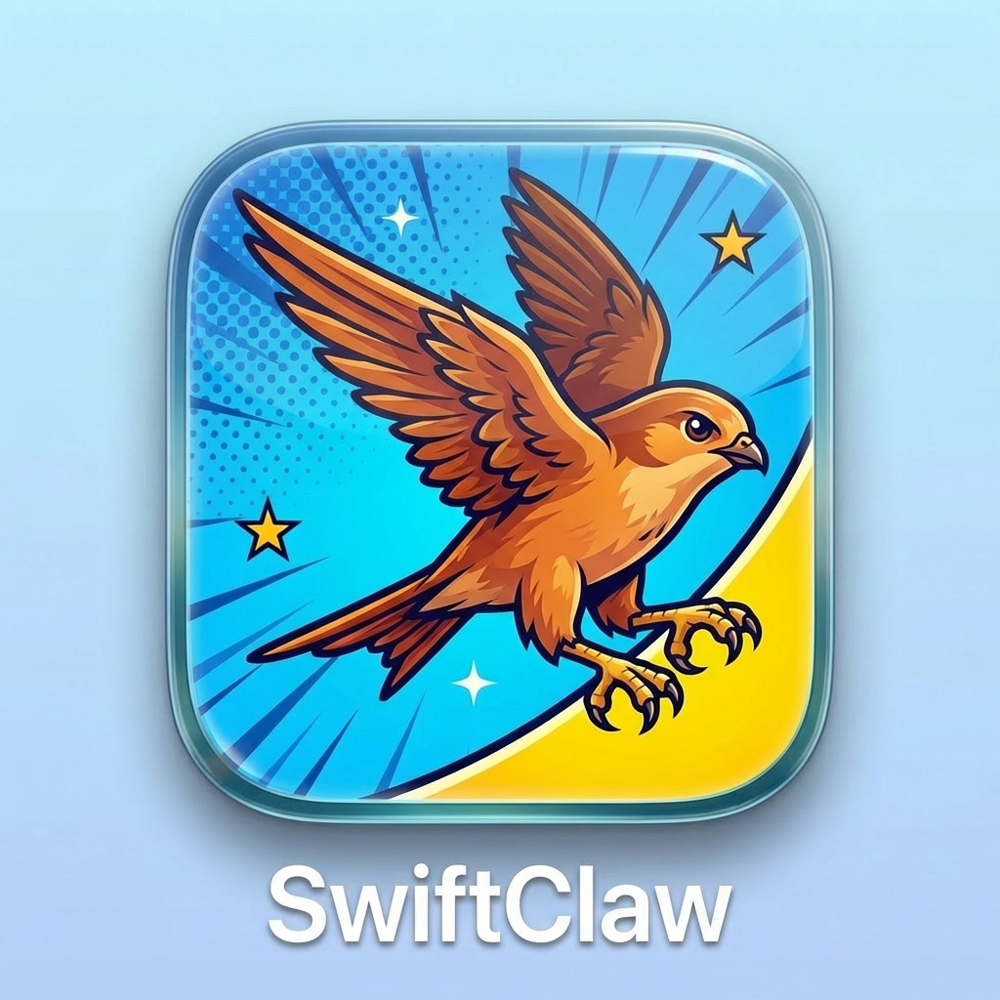

# SwiftClaw

<p align="center">
  
</p>

A macOS-first, Swift-native AI agent framework with on-device MLX inference. Privacy-first, self-hosted, no cloud surface.

## Overview

SwiftClaw lets you build agentic applications in Swift that run fully on-device using Apple Silicon. It handles the agentic loop (prompt → LLM → tool calls → results → loop), exposes a clean protocol-based tool system, and talks to local MLX models via [mlx-swift-lm](https://github.com/ml-explore/mlx-swift-lm). An HTTP backend targets OpenAI-compatible APIs (Ollama, etc.) for non-MLX use.

**Philosophy:** All model weights and agent state stay local by default. No vendor lock-in — agents are Swift code + config, not tied to a cloud SDK.

## Requirements

- macOS 15+
- Apple Silicon (M1 or later)
- Swift 6.2+
- [mlx-swift-lm](https://github.com/ml-explore/mlx-swift-lm) (pulled automatically via SPM)

## Quick Start

```bash
# Build (debug — sufficient for HTTP backend and tests)
swift build

# MLX inference requires a release build + colocated metallib
swift build -c release
# Copy mlx.metallib (see MLX Setup below)
.build/release/swiftclaw run

# HTTP/Ollama backend (no metallib needed)
.build/release/swiftclaw run --backend http --api-url http://localhost:11434/v1

# Check system compatibility
swift run swiftclaw doctor

# List available tools
swift run swiftclaw tools
```

The first `run` with the MLX backend downloads the default model (`mlx-community/Qwen3.5-9B-MLX-4bit`, ~5GB) from Hugging Face.

## MLX Setup (one-time)

```bash
swift build -c release
# Find mlx version from Package.resolved, then:
pip install --target /tmp/mlx-metallib mlx==<version>
cp /tmp/mlx-metallib/mlx/core/mlx.metallib .build/release/
.build/release/swiftclaw run
```

## Package Structure

```
SwiftClaw/
  Sources/
    SwiftClawCore/      # Agent runtime, session, tool protocol, model backend protocol, memory protocol
    SwiftClawMLX/       # MLX backend, LoRA training, adapter management, A/B eval, MLX embedding engine
    SwiftClawHTTP/      # OpenAI-compatible HTTP backend (Foundation-only, targets Ollama/OpenAI)
    SwiftClawTools/     # Built-in tools (sysadmin, file ops, environment)
    SwiftClawMemory/    # Semantic memory — SQLite+FTS5 via GRDB, hybrid retrieval, EmbeddingEngine
    SwiftClawPippin/    # Pippin CLI wrappers (mail + memos tools)
    SwiftClawUI/        # SwiftUI components (chat view, sidebar, tool approval, settings)
    SwiftClawApp/       # macOS app target — SwiftUI wrapper around SwiftClawCore
    swiftclaw/          # CLI executable (ArgumentParser)
  Tests/
    SwiftClawCoreTests/
    SwiftClawHTTPTests/
    SwiftClawMemoryTests/
    SwiftClawMLXTests/
    SwiftClawPippinTests/
    SwiftClawToolsTests/
```

### Libraries

| Target | Purpose |
|--------|---------|
| `SwiftClawCore` | Core types: `Agent`, `Session` actor, `SwiftClawTool` protocol, `ModelBackend` protocol, `MemoryProvider` protocol, `JSONSchema`, `ContextCompressor`, `TraceExporter` |
| `SwiftClawMLX` | `MLXBackend` — on-device inference via mlx-swift-lm; `LoRATrainer`, `AdapterStore`, `AdapterSelector`, `EvalStore`, `MLXEmbeddingEngine` |
| `SwiftClawHTTP` | `HTTPBackend` — OpenAI-compatible REST + SSE; Foundation-only, no third-party networking |
| `SwiftClawTools` | Drop-in tools: sysadmin (4), file (4), environment (3); `SwiftClawToolFactory.allTools(config:)` |
| `SwiftClawMemory` | `MemoryStore` actor (GRDB+FTS5, two-layer working/longTerm), `EmbeddingEngine` (hash-based 768-dim), `MemoryRetriever` (hybrid scoring); `MemoryToolFactory.allTools(store:)` |
| `SwiftClawPippin` | Pippin CLI wrappers — 6 mail tools + 3 memos tools; gracefully absent if binary not found |
| `SwiftClawUI` | Reusable SwiftUI components: streaming chat, sidebar, tool approval, settings popover |
| `SwiftClawApp` | macOS app — `@Observable` agent state, shares `FileSessionStore` with the CLI |

## Defining an Agent

```swift
import SwiftClawCore
import SwiftClawMLX
import SwiftClawTools

let backend = try await loadMLXBackend(modelId: "mlx-community/Qwen3.5-9B-MLX-4bit")

let agent = Agent(configuration: AgentConfiguration(
    name: "MyAgent",
    systemPrompt: "You are a helpful macOS assistant.",
    tools: [SystemInfoTool(), DiskSpaceTool()],
    modelId: "mlx-community/Qwen3.5-9B-MLX-4bit"
))

let session = Session(agent: agent, backend: backend)
for try await event in session.respond(to: "How much disk space do I have?") {
    if case let .textDelta(text) = event {
        print(text, terminator: "")
    }
}
```

## Writing a Custom Tool

```swift
import SwiftClawCore

struct GreetTool: SwiftClawTool {
    let name = "greet"
    let description = "Greet someone by name."
    let parameterSchema: JSONSchema = .object(
        properties: ["name": .string(description: "Name to greet")],
        required: ["name"]
    )

    func execute(arguments: String) async throws -> ToolResult {
        struct Args: Decodable { var name: String }
        let args = try JSONDecoder().decode(Args.self, from: Data(arguments.utf8))
        return .success("Hello, \(args.name)!")
    }
}
```

## Built-in Tools

### Sysadmin (SwiftClawTools)

| Tool | Description |
|------|-------------|
| `system_info` | Hostname, CPU cores, memory, macOS version |
| `disk_space` | Total, used, and free disk space for any path |
| `process_list` | Running processes sorted by memory usage |
| `shell` | Sandboxed shell execution (allowlist + redirect/pipe guard) |

### File Operations (SwiftClawTools)

| Tool | Description |
|------|-------------|
| `read_file` | Read file contents within sandbox paths |
| `write_file` | Write or replace file contents within sandbox paths |
| `list_directory` | List directory contents |
| `find_files` | Recursive file search by name pattern |

### Environment (SwiftClawTools)

| Tool | Description |
|------|-------------|
| `env_vars` | Read environment variables |
| `date_time` | Current date, time, and timezone |
| `clipboard` | Read macOS clipboard contents |

### Memory (SwiftClawMemory — enabled with `--memory`)

| Tool | Description |
|------|-------------|
| `memory_write` | Store a fact or note in semantic memory |
| `memory_read` | Retrieve a memory entry by ID |
| `memory_search` | Hybrid semantic + BM25 search across memory |
| `memory_delete` | Remove a memory entry by ID |

### Pippin Mail (SwiftClawPippin)

| Tool | Description |
|------|-------------|
| `mail_list` | List messages in a mailbox |
| `mail_show` | Read a specific message |
| `mail_search` | Search messages by query, date range, sender |
| `mail_send` | Compose and send a message |
| `mail_mark` | Mark messages as read/unread/flagged |
| `mail_move` | Move messages between mailboxes |

### Pippin Memos (SwiftClawPippin)

| Tool | Description |
|------|-------------|
| `memos_list` | List voice memos |
| `memos_info` | Get metadata for a memo |
| `memos_transcribe` | Transcribe a voice memo |

## CLI Commands

| Command | Description |
|---------|-------------|
| `swiftclaw run [--backend mlx\|http] [--api-url URL] [--session ID] [--adapter PATH] [--auto-adapter] [--memory]` | Interactive agent REPL |
| `swiftclaw tools [--json]` | List registered tools |
| `swiftclaw doctor` | System diagnostics (MLX, model cache, memory DB, config) |
| `swiftclaw sessions list\|show\|delete\|export <id>` | Session management + LoRA trace export |
| `swiftclaw train --name <n> --sessions <id1,id2> [--iterations N]` | Train a LoRA adapter from session traces |
| `swiftclaw adapters list\|delete\|tag <name>` | Adapter lifecycle management |
| `swiftclaw eval "prompt" [--adapter-a <n>] --adapter-b <n>` | A/B evaluation between base model and adapters |
| `swiftclaw download [--model ID]` | Pre-download a model to the cache |

## Architecture

- **`Session` is an actor** — owns the mutable conversation array; data-race-safe by default
- **`Agent` is a struct** — immutable config + tool registry; freely `Sendable`
- **`ModelBackend` is a protocol** — swap MLX for HTTP without changing the agentic loop
- **`MemoryProvider` is a protocol** — swap in any memory backend; `MemoryStore` is the default (SQLite+FTS5 via GRDB)
- **Tool arguments are JSON strings** — avoids `Any` which isn't `Sendable`
- **Swift 6 strict concurrency** — no workarounds; compiles clean with zero warnings
- **Two-layer memory** — working memory per-session, promoted to longTerm on `endSession()`; hybrid retrieval (semantic 0.5 + BM25 0.25 + recency 0.15 + frequency 0.10)
- **LoRA fine-tuning** — export sessions as JSONL training traces, train adapters via `MLXOptimizers`, A/B eval against base model

## Running Tests

```bash
swift test
```

249 tests across 6 test targets. Core tests use a `MockBackend` — no model download needed.

## Roadmap

- **v4.8** (current): Hash-anchored file edits — `read_file` emits per-line content hashes on demand; `edit_file` accepts an `anchor_line`/`anchor_hash` pair and rejects stale edits before applying

**Near-term (P0 — Week 1-2):**
- ~~Prompt caching for HTTP backend (stable system prompt + user-injected skills → 50%+ API cost reduction)~~
- ~~Calendar tool exposure in SwiftClawPippin (`CalendarEventsTool`, `CalendarCreateTool`, `CalendarSmartCreateTool`)~~
- ~~Sentinel process monitoring (replace `sleep` startup hacks with `__READY__` marker polling)~~

**Short-term (P1 — Month 1):**
- ~~Two-layer memory: wire `AgentMemory` into the session loop with MEMORY.md consolidation (nanobot/hermes pattern)~~
- ~~Token counting for HTTP backend (cost visibility and limit warnings)~~
- ~~Hash-anchored file edits — line-hash tagging makes `write_file`/`edit` stale-safe on large files~~
- Lazy skill loading — send skill summaries first; fetch full content on demand
- Credential proxy — secrets intercepted before tool execution; prevents key leakage into LoRA training data
- Apple Container sandbox for `shell` tool (macOS 26 native, replaces `FileSandbox`)
- Per-conversation FIFO queue (prevents concurrent session corruption)

**Mid-term (P2 — Month 2-3):**
- Vision OCR for macOS GUI automation (Vision.framework + `screencapture`; fixes JXA fragility on Electron apps)
- MCP client integration (standard Anthropic protocol; 200+ external tool servers)
- Cross-provider conversation handoff — `ContextTranslator` protocol for MLX → HTTP fallback mid-conversation
- JSONL session branching (tree-structured; avoids duplication on forks)
- Background parallel agent execution
- Metric-driven LoRA adapter iteration loop (autoresearch-style keep/revert on val_bpb metric)

**Long-term (P3):**
- iOS support
- Remote/cloud model backends
- Subagent parallelism (actor-isolated subagents)
- 3-tier context assembly (recent messages + retrieved memories + agent CLAUDE.md)
- GrimClaw ↔ SwiftClaw HTTP bridge (Pi agent delegates macOS tasks to SwiftClaw)
- A2UI Canvas (agent-generated SwiftUI views in the app canvas panel)
- agentskills.io standard migration (YAML frontmatter + markdown skills for ecosystem compatibility)

## License

MIT
